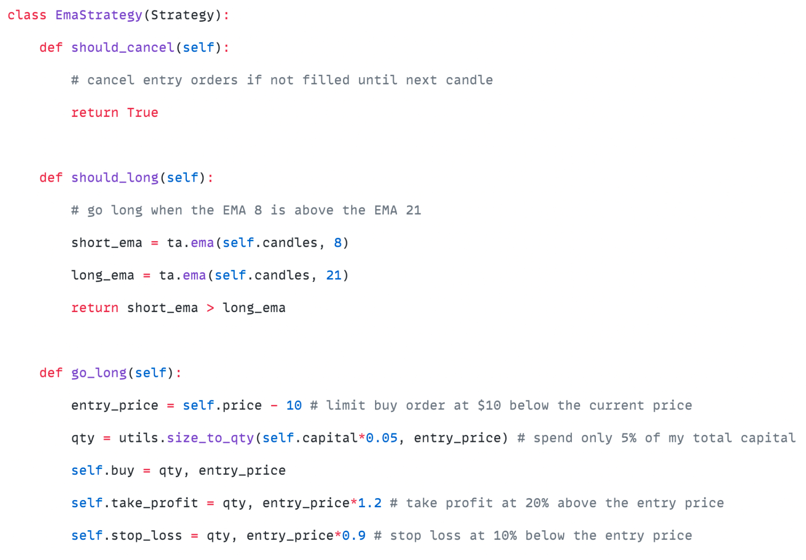
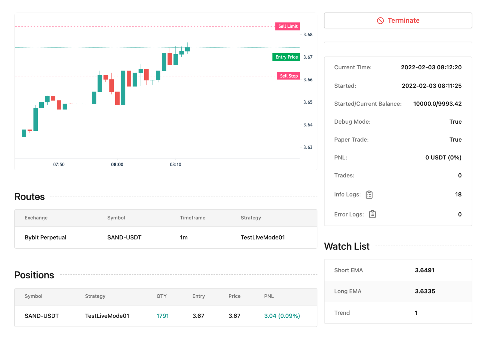
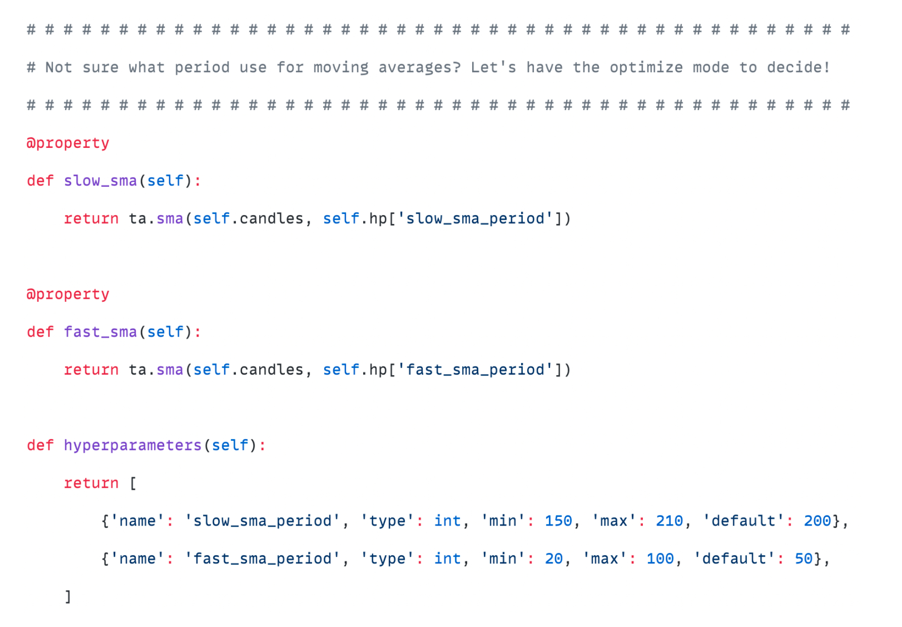
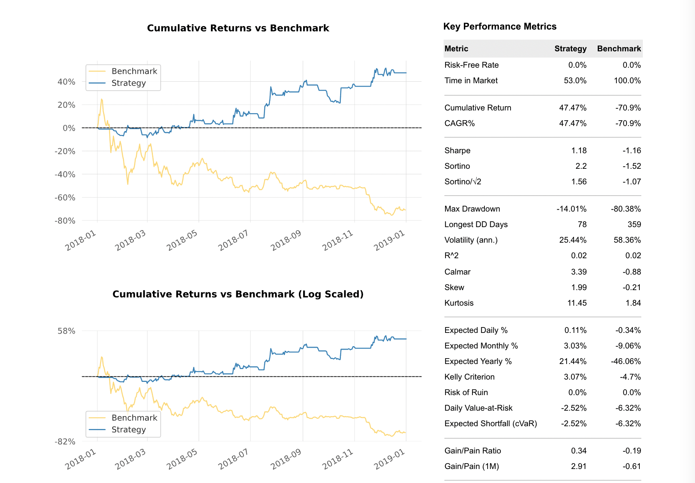

<div align="center">
<br>
<p align="center">

</p>

<p align="center">
Algo-trading was 😵‍💫, we made it 🤩
</p>
</div>

# Algorithex

A local, self-hosted fork of the Algorithex trading framework. The Python package is `algorithex`.
Upstream MIT attribution is preserved in `LICENSE`; all local branding, packaging, and Docker names use Algorithex.

---

Algorithex is an advanced crypto trading framework that aims to **simplify** **researching** and defining **YOUR OWN trading strategies** for backtesting, optimizing, and paper trading — fully local, no website account needed.

## What is Algorithex?
Algorithex runs the proven Algorithex research engine locally under your own brand: backtests, optimization, Monte Carlo, and rule significance tests without redirects or license tokens.

## Why Algorithex?
In short, Algorithex is more **accurate** than other solutions, and way more **simple**.
In fact, it is so simple that in case you already know Python, you can get started today, in **matter of minutes**, instead of **weeks and months**. 

## Key Features

- 📝 **Simple Syntax**: Define both simple and advanced trading strategies with the simplest syntax in the fastest time.
- 📊 **Comprehensive Indicator Library**: Access a complete library of technical indicators with easy-to-use syntax.
- 📈 **Smart Ordering**: Supports market, limit, and stop orders, automatically choosing the best one for you.
- ⏰ **Multiple Timeframes and Symbols**: Backtest and livetrade multiple timeframes and symbols simultaneously without look-ahead bias.
- 🔒 **Self-Hosted and Privacy-First**: Designed with your privacy in mind, fully self-hosted to ensure your trading strategies and data remain secure.
- 🛡️ **Risk Management**: Built-in helper functions for robust risk management.
- 📋 **Metrics System**: A comprehensive metrics system to evaluate your trading strategy's performance.
- 🔍 **Debug Mode**: Observe your strategy in action with a detailed debug mode.
- 🔧 **Optimize Mode**: Search strategy parameters efficiently with Optuna and parallel processing powered by Ray.
- 📈 **Leveraged and Short-Selling**: First-class support for leveraged trading and short-selling.
- 🔀 **Partial Fills**: Supports entering and exiting positions in multiple orders, allowing for greater flexibility.
- 🔔 **Advanced Alerts**: Create real-time alerts within your strategies for effective monitoring.
- 🔌 **Algorithex MCP**: Connect Claude, Codex, Cursor, VS Code, Zed, and other MCP-compatible AI assistants directly to your local Algorithex project.
- 🔧 **Built-in Code Editor**: Write, edit, and debug your strategies with a built-in code editor.
- 📊 **Interactive Trading Charts**: Inspect candles, strategy indicators, horizontal levels, orders, and completed trades across backtest, paper, and live sessions.
- 🔬 **Rule Significance Testing**: Test whether an entry rule shows genuine historical edge or could have appeared by chance.
- 🎲 **Monte Carlo Analysis**: Stress-test your strategies with trade-order shuffling and candles-based simulations to distinguish skill from luck and guard against overfitting.
- 🧠 **Machine Learning**: A built-in ML pipeline — gather labelled training data from backtests, train scikit-learn models (binary, multiclass, or regression), and deploy predictions directly inside your strategies.
- 🧪 **Research API and Jupyter**: Run backtests, optimization, significance tests, Monte Carlo analysis, candle workflows, and machine learning from Python scripts or notebooks.
- 🦀 **Rust-Powered Indicators**: Native Rust implementations make indicator-heavy strategies and large research runs substantially faster.
- 🤖 **Reinforcement Learning — Coming Soon**: First-class reinforcement-learning workflows built on Algorithex's simulation and research stack are on the way.
- 📺 **Youtube Channel**: Algorithex has a Youtube channel with screencast tutorials that go through example strategies step by step.

## Dive Deeper into Algorithex's Capabilities

### Stupid Simple
Craft complex trading strategies with remarkably simple Python. Access 300+ indicators, multi-symbol/timeframe support, spot/futures trading, partial fills, and risk management tools. Focus on logic, not boilerplate.

```python
class GoldenCross(Strategy):
    def should_long(self):
        # go long when the EMA 8 is above the EMA 21
        short_ema = ta.ema(self.candles, 8)
        long_ema = ta.ema(self.candles, 21)
        return short_ema > long_ema

    def go_long(self):
        entry_price = self.price - 10        # limit buy order at $10 below the current price
        qty = utils.size_to_qty(self.balance*0.05, entry_price) # spend only 5% of my total capital
        self.buy = qty, entry_price                 # submit entry order
        self.take_profit = qty, entry_price*1.2  # take profit at 20% above the entry price
        self.stop_loss = qty, entry_price*0.9   # stop loss at 10% below the entry price
```

### Backtest
Execute highly accurate and fast backtests without look-ahead bias. Utilize debugging logs, interactive charts with indicator support, and detailed performance metrics to validate your strategies thoroughly.


### Interactive Trading Charts
Inspect your strategy where its decisions happened. Algorithex combines candlesticks, strategy-added indicators and levels, executed orders, and completed trades in synchronized interactive charts. The same charting workflow is available for backtests and for running or completed paper/live sessions.


Expand a trade to inspect every execution, collapse or isolate indicator panes, follow OHLC and indicator values under the cursor, reset the view, use fullscreen mode, or export the chart as an image.


Explore Algorithex's interactive charts →

### Live/Paper Trading
Deploy strategies live with robust monitoring tools. Supports paper trading, multiple accounts, real-time logs & notifications (Telegram, Slack, Discord), interactive charts, spot/futures, DEX, and a built-in code editor.


### Benchmark
Accelerate research using the benchmark feature. Run batch backtests, compare across timeframes, symbols, and strategies. Filter and sort results by key performance metrics for efficient analysis.


### Algorithex MCP: Your AI Assistant, Connected to Algorithex
Algorithex includes a local Model Context Protocol (MCP) server. Connect your preferred AI assistant and let it work with Algorithex's real tools and project context instead of merely guessing how your trading framework behaves.

Through Algorithex MCP, an assistant can help you write and improve strategies, manage candle data, run and inspect backtests, perform rule significance tests, optimize parameters, run Monte Carlo simulations, and link you directly to the saved results in the Algorithex dashboard. Your strategies and data remain under your control in your self-hosted Algorithex setup.

For example, you can ask:

> Check whether my new entry rule is statistically significant, backtest it, optimize the promising parameters, and run a candles-based Monte Carlo analysis before we consider paper trading.

Connect Claude, Codex, Cursor, VS Code, or Zed to Algorithex →

### Rule Significance Testing
Before spending hours building and tuning a complete strategy, test whether its entry rule has a measurable historical edge. Algorithex compares the rule against a bootstrap distribution of random entries on the same market history, helping you reject noisy ideas early and focus your research on signals worth developing.

Learn about Rule Significance Testing →

### Monte Carlo Analysis
Stress-test your strategies beyond a single historical path. Algorithex's Monte Carlo mode runs hundreds of simulations using **trade-order shuffling** (tests whether trade timing drove your results) and **candles-based** (tests robustness under slightly different market conditions) methods. Use it to distinguish skill from luck, understand the range of outcomes you can realistically expect, and catch overfitting early.

### Machine Learning
Algorithex includes a complete, end-to-end ML pipeline built for trading strategies:

1. **Gather data** — run a backtest in gather mode; call `record_features({...})` at each signal bar and `record_label(name, value)` when the outcome is known. Data is auto-saved to CSV.
2. **Train a model** — call `train_model()` with any scikit-learn–compatible estimator and choose a task type: `"binary"` classification, `"multiclass"` classification, or `"regression"`. Get a full report with feature importance, calibration, and metrics.
3. **Deploy** — switch to deploy mode and call `ml_predict()` or `ml_predict_proba()` inside your strategy. Model loading, scaling, and feature ordering are handled automatically.

```python
# Gather phase — inside your strategy
def before(self):
    self.record_features({
        'rsi': ta.rsi(self.candles),
        'adx': ta.adx(self.candles),
    })

# Deploy phase — gate entries with model confidence
def should_long(self):
    proba = self.ml_predict_proba()
    return proba['long'] > 0.65
```

Explore Algorithex's machine-learning pipeline →

### Research API and Jupyter Notebooks
Everything does not have to happen through the dashboard. Algorithex's Research API exposes candle management, backtesting, optimization, Rule Significance Testing, Monte Carlo analysis, indicators, and machine learning to ordinary Python scripts and Jupyter notebooks. Use it for reproducible experiments, custom reports, batch research, or integration with your existing data-science workflow.

Explore the Research API →

### Rust-Powered Performance
Algorithex's indicators are powered by native Rust, making them significantly faster than common alternatives such as TA-Lib.

### Reinforcement Learning — Coming Soon
We are working on first-class reinforcement-learning support built on Algorithex's simulation and research stack. The goal is to make training, evaluating, and deploying reinforcement-learning agents feel as integrated as Algorithex's existing backtesting, optimization, Monte Carlo, and machine-learning workflows.

### Optimize Your Strategies
Unsure about optimal parameters? Let the optimization mode decide using simple syntax. Fine-tune any strategy parameter with the Optuna library and easy cross-validation.

```python
@property
def slow_sma(self):
    return ta.sma(self.candles, self.hp['slow_sma_period'])

@property
def fast_sma(self):
    return ta.sma(self.candles, self.hp['fast_sma_period'])

def hyperparameters(self):
    return [
        {'name': 'slow_sma_period', 'type': int, 'min': 150, 'max': 210, 'default': 200},
        {'name': 'fast_sma_period', 'type': int, 'min': 20, 'max': 100, 'default': 50},
    ]
```

## Getting Started

Everything runs locally — no account and no website required:

```bash
cd my-bot/docker
docker compose up -d
```

Then open <http://localhost:9000>. The dashboard password is `PASSWORD` in `my-bot/.env`.
The MCP server is at <http://localhost:9002/mcp>; see [AGENTS.md](AGENTS.md) for the
strategy-authoring workflow it exposes.

## Screenshots









## Disclaimer
This software is for educational purposes only. USE THE SOFTWARE AT **YOUR OWN RISK**. THE AUTHORS AND ALL AFFILIATES ASSUME **NO RESPONSIBILITY FOR YOUR TRADING RESULTS**. **Do not risk money that you are afraid to lose**. There might be **bugs** in the code - this software DOES NOT come with **ANY warranty**.
